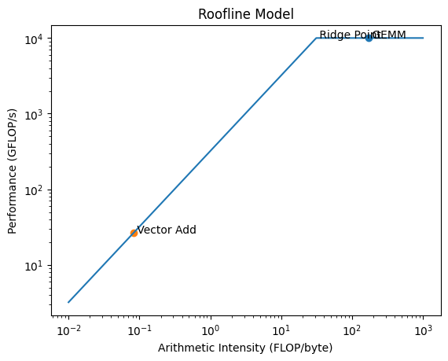

# CMAN — Roofline Construction and Kernel Classification

## Hardware
- Peak Compute = 10 TFLOPS (FP32) = 10,000 GFLOP/s  
- Peak DRAM Bandwidth = 320 GB/s  
- Ridge Point = 31.25 FLOP/byte  

---

## (a) Roofline Diagram

- Diagonal (bandwidth-limited): P = 320 × AI  
- Flat ceiling (compute-limited): P = 10,000 GFLOP/s  
- Ridge point: (31.25 FLOP/byte, 10,000 GFLOP/s)

---

## (b) Kernel A — Dense GEMM (1024×1024)

**FLOPs:**  
2 × 1024³ = 2,147,483,648  

**Bytes:**  
A = 4,194,304  
B = 4,194,304  
C = 4,194,304  
Total = 12,582,912  

**AI:**  
170.7 FLOP/byte  

**Performance:**  
10,000 GFLOP/s  

**Bound:**  
Compute-bound  

**Recommendation:**  
Increase compute throughput (more FMA units or wider SIMD).

---

## (c) Kernel B — Vector Addition (4,194,304 elements)

**FLOPs:**  
4,194,304  

**Bytes:**  
A = 16,777,216  
B = 16,777,216  
C = 16,777,216  
Total = 50,331,648  

**AI:**  
0.083 FLOP/byte  

**Performance:**  
26.7 GFLOP/s  

**Bound:**  
Memory-bound  

**Recommendation:**  
Increase memory bandwidth (e.g., HBM).

---

## (d) Summary

| Kernel | FLOPs | Bytes | AI | Bound | GFLOP/s |
|--------|------|------|----|------|--------|
| GEMM | 2,147,483,648 | 12,582,912 | 170.7 | Compute | 10,000 |
| Vector Add | 4,194,304 | 50,331,648 | 0.083 | Memory | 26.7 |
